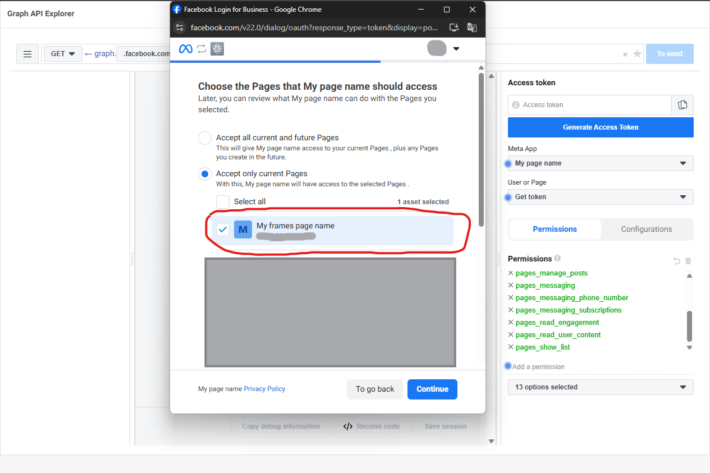
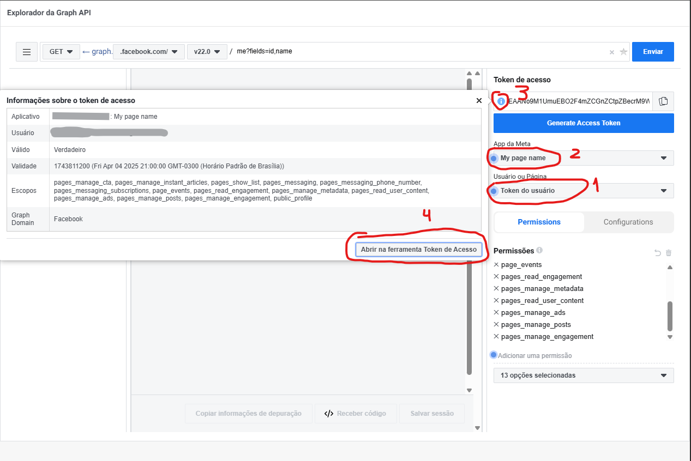
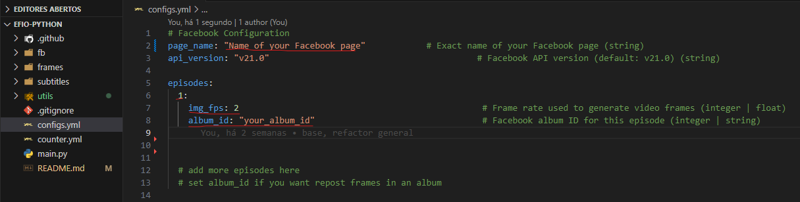

<h1 align="center">Every <sup><sub><sub>(name)</sub></sub></sup> Frame in Order BOT</h1>

<div align="center">

    A bot that automatically posts video frames to Facebook Pages.
    Useful for projects like “Every Frame in Order” or similar automated series.
</div>


### Table of contents

- [Criando um app do facebook](#criando-um-app-do-facebook)
- [Fazendo o app do facebook publico](#fazendo-o-app-do-facebook-publico)
- [Gerando um access token](#gerando-um-access-token)
- [Tornando o token de acesso permanente](#tornando-o-token-de-acesso-permanente)
- [Configurando o bot](#configurando-o-bot)
- [Fazendo o commit das alterações](#fazendo-o-commit-das-alterações)
- [Rodar seu bot manualmente](#rodar-seu-bot-manualmente)


### Criando um app do facebook
<details><summary>click to expand</summary><br>

Antes de começar, certifique-se de ter uma pagina do Facebook ativa

<p align="center">
  
</p>

- Clique em My Apps

<p align="center">
  
</p>

- Clique em Create application para criar um novo app

<p align="center">
  
</p>

- De um nome a seu app, pode ser qualquer nome, por exemplo EFIO, e um email

<p align="center">
  
</p>

- Em Use cases escolha Other

<p align="center">
  
</p>

- Em Type escolha Business

<p align="center">
  
</p>

- Clique em `Create application`, sua senha será solicitada, confirme e continue

</details>

---

### Fazendo o app do facebook publico
<details><summary>click to expand</summary><br>

- Acesse o App/Settings/Basic
<p align="center">
  
</p>

- Em sua Privacy Policy URL coloque o link do google https://google.com/, depois clique em Save Changes
<p align="center">
  
</p>

- Para que seu conteudo seja publicado e visivel para todos os usuarios, selecione Application mode para live 

<p align="center">
  
</p>

</details>

---

### Gerando um access token
<details><summary>click to expand</summary><br>

- Acesse o Tools/Graph API Explorer
<p align="center">
  
</p>

- Selecione todas as permissoes de pagina
<p align="center">
  
</p>

- Selecione seu app name, e pagina
<p align="center">
  
</p>

- Confirme sua pagina de frames e aceite os demais termos   
<p align="center">
  
</p>

- As permissoes devem ficar em preto, caso contrario refaça o processo
<p align="center">
  
</p>

</details>

---

### Tornando o token de acesso permanente
<details><summary>click to expand</summary><br>

- Verifique o se tudo esta conforme a imagem, App meta, with your app name and User or page, with your user token and click on 🛈 icon and click on tool Open in access token tool
<p align="center">
  
</p>

- Extenda e copie o token de acesso e volte para a aba anterior
<p align="center">
  
</p>

- Subistitua o codigo de acesso pelo novo que voce copiou, cheque o App meta, with your app name and User or page, with your page name e extenda o token de acesso novamente.
<p align="center">
  
</p>

- Voce obterá um token de acesso permanente. Copie ele e save, ele sera importante mais tarde.
<p align="center">
  
</p>

</details>

---

### Configurando o bot
<details><summary>click to expand</summary><br>

- Aceesse o link do repositorio [EFIO-PYTHON](https://github.com/JavaRaf/EFIO-PYTHON) e clicque em Use this template para copiar o repositorio para seu perfil do github

- Apos copiar o repositorio, acesse as configuracoes do repositorio e va ate Settings/Secrets and variables/Actions
<p align="center">
  
</p>

- Clique em New repository secret e adicione o token de acesso que voce gerou anteriormente, usando o nome FB_TOKEN
<p align="center">
  
</p>

</details>

---

### Clone o repositorio no seu pc
<details><summary>click to expand</summary><br>

- Abra o terminal e digite git clone <url do repositorio>
<p align="center">
  
</p>
<p align="center">
  
</p>

</details>

---

### Gerando os frames
<details><summary>click to expand</summary><br>

#### Usando o [FFmpeg](https://ffmpeg.org/)

- Com o ffmepg  ja instalado, abra o terminal e digite o comando <br> `ffmpeg -i "video.mkv" -vf "fps=2" -fps_mode vfr -q:v 3 "frame_%00d.jpg"`
<br><br>
 Onde:
<br>
- `video.mkv` e o nome do arquivo do video
- `fps=2` o fps do video (1 a 60, quanto maior, mais frames por segundo serão gerados)
- `-fps_mode vfr` e o fps mode (vfr = variable frame rate)
- `-q:v 3` e a qualidade do frame (1 a 5, quanto maior pior a qualidade)
- `frame_%00d.jpg` e o nome do arquivo do frame e destino

<font color="green">Nota: voce deve criar uma pasta para os frames de saida para melhorar a organizacao, por exemplo 01 para o episodio 1, 02 para o episodio 2, etc...</font>

<p align="center">
  
</p>

</details>

---

#### Usando o Frame Chopper
<details><summary>click to expand</summary><br>


- baixe o aplicativo [Frame Chopper](https://github.com/JavaRaf/Frame-Chopper), abra-o e instale, agora selecione o arquivo do video, pasta de saida, fps, qualidade e clique em Generate    

<p align="center">
  
</p>

</details>

---

### Copiando os frames
<details><summary>click to expand</summary><br>

#### Após gerar os frames, copie a pasta 01 com todos os frames dentro e cole na pasta frames do repositorio
<p align="center">
  
</p>

</details>

---

### Voce tambem pode incluir legendas do tipo .ass
<details><summary>click to expand</summary><br>

- Dentro da pasta subtitles crie uma pasta com o nunero do episodio, por exemplo 01 e cole o arquivo dentro
- Essas legendas  serão usadas para o bot postar as legendas no post ou no comentario do frame

</details>

---

### Configurando o bot
<details><summary>click to expand</summary><br>

- Nessa parte voce tera que configurar o arquivo config.yml
- abrar  o repositorio no seu editor de codigo, por exemplo VSCode
- no arquivo config.yml voce precisara configurar o page_name com o nome da sua pagina, isso ajudara a checar se seu FB_TOKEN e valido
- Em episodes, voce tera que cria um objeto com o numero do episodio, nesse exemplo, o 1
- img_fps: e o fps do video que voce gerou os frames
- o album_id serve para repostar osframes dentro de um album do facebook, voce pode criar um album no facebook e pegar o id dele e colar aqui
<p align="center">
  
</p>

- voce pode adicionar mais episodes no futuro

</details>

---

### Fazendo o commit das alterações
<details><summary>click to expand</summary><br>

- Abra o terminal, na pasta do repositorio e digite 

```bash
    git add .
    git commit -m "initial commit"
    git push origin main
```

</details>

---

### Rodar seu bot manualmente
<details><summary>click to expand</summary><br>

- Apos empurar todas suas alterações para o github, voce pode rodar o bot manualmente
- Va ate seu repositorio no github e clique em Actions, e clique em Init banner and Run workflow
<p align="center">
  
</p>

</details>

---
